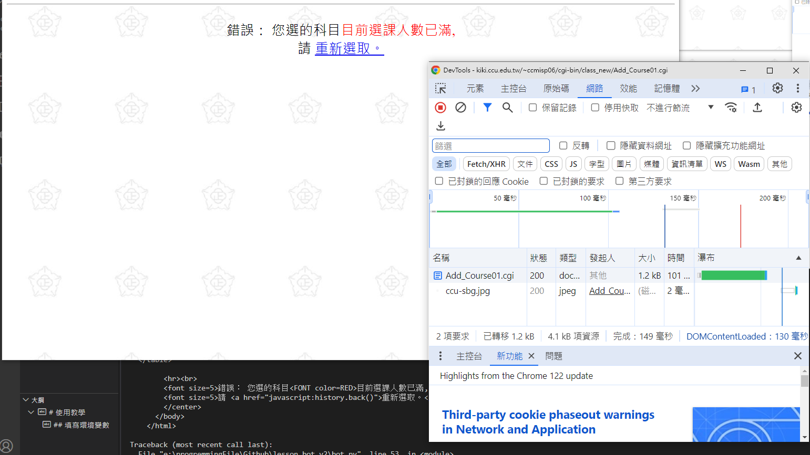

# 使用教學
## 填寫環境變數
* 填寫登入選課系統的帳密
* 填寫選課系統 request payload
  1. 來到要選的課程頁面，按下 F12，選擇 "網路"
  
  1. 點選要選的課程，按下送出，留意多出來的 .cgi
  
  1. 點擊該 .cgi，選擇 "酬載"，複製其中全部的內容
  
  1. 請 chatGPT 轉成 JSON 格式後，填入 `PAYLOAD` 變數

範例:
```env
# 選課系統帳號
ACCOUNT="Account"

# 選課系統密碼
PASSWORD="Password"

# 選課系統 request payload
PAYLOAD='{
"session_id": "HAHAHA",
"dept": "5304",
"grade": "3",
"cge_cate": "",
"cge_subcate": "",
"page": "1",
"e": "0",
"m": "0",
"SelectTag": "1",
"5303111_01": "2",
"5303213_01": "2",
"5303221_01": "2",
"5303229_01": "1",
"5303233_01": "1",
"5303234_01": "2",
"course": "5303239_01",
"5303239_01": "2"
}'
```

# 執行程式
1. 在電腦上安裝 docker
2. 輸入以下指令
```
docker build -t "lessonbot" .
docker run --env-file .env -d lessonbot
```